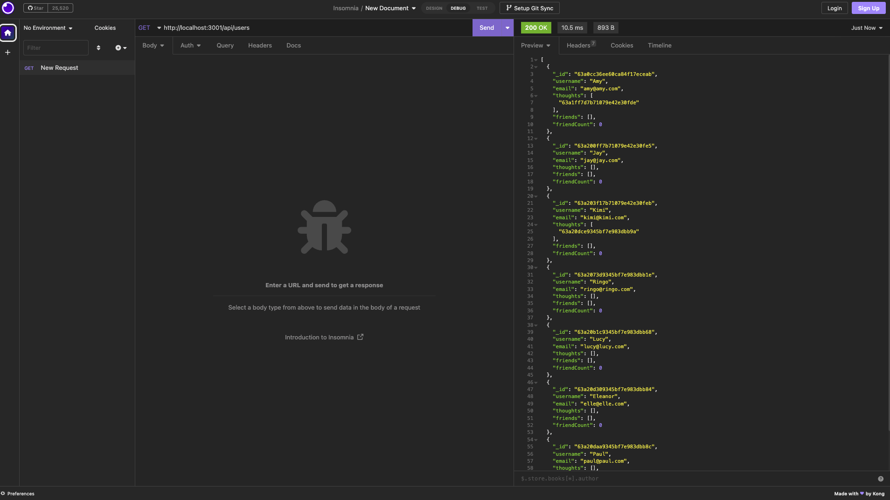

# Social Network API

Click [here](https://drive.google.com/file/d/1GUfmwpt1mGi9OOci4j7OBxPBImVpxPK8/view) to see the video walk-though.

## Description

This back-end application is a social network API that allows users to share thoughts, react to friends' thoughts, and create a friend list. 

## Installation

Install dependencies with the following command:
```
npm i
```

## Usage

After installing dependencies, invoke the application using:
```
npm start
```

Run routes in insomnia, as shown here:


## Technology

- Javascript
- Node.js
- Express.js
- Moment.js
- MongoDB
- Mongoose
